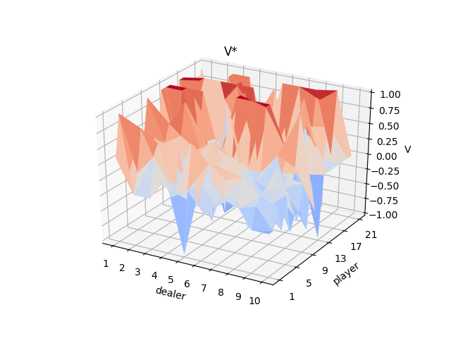
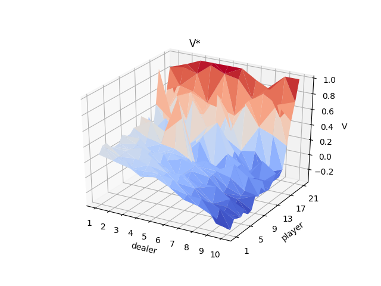
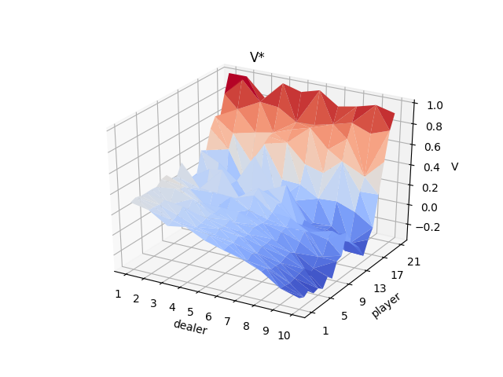
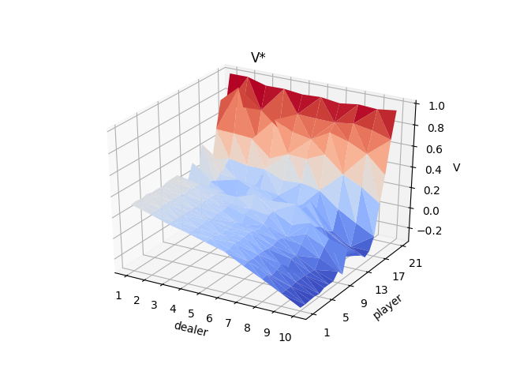

# monte-carlo control

| itr = 1,000 | itr = 20,000 |
:-------------:|:--------------:
 | 
| itr = 100,000 | itr = 1,000,000 |
 | 

### __WORKING ITEMS__
---
<ul style="list-style-type:upper-roman;">
    <li>
        Move to a completely numpy centric style.
        <ol style="list-style-type:lower-greek;">
            <li>
                It will be faster & more space efficient
            </li>
            <li>
                It will be more adaptable to future AI techniques & concepts
            </li>
            <li>
                It will develop linear algebra related reasoning skill & general comfort
            </li>
        </ol >
    </li>
</ul>