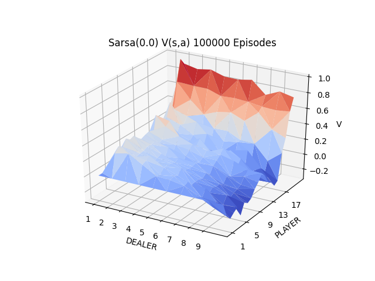

# sarsa(λ)

### __Value Functions: λ & Episodes Vary__
| | | |
|-|-|-|
 |  | 
 |  | 

### __Mean Squared Error vs λ: Episodes Vary__
| | |
|-|-|
 | 

### __Training Curves: MSE vs Episodes__
| | |
|-|-|
 | 

### __WORKING ITEMS__
---
<ul style="list-style-type:upper-roman;">
    <li>
        Look into a NumPy centric style vs using hashmaps & NumPy.
        <ol style="list-style-type:lower-greek;">
            <li>
                Would it be faster or more space efficient?
            </li>
            <li>
                Would it be more adaptable to future AI techniques & concepts?
            </li>
            <li>
                It would help develop linear algebra related reasoning skill & familiarity.
            </li>
        </ol >
    </li>
    <li>
        Look into dark themed graphs.
        <ol style="list-style-type:lower-greek;">
            <li>
                More stimulating?
            </li>
            <li>
                Better presentations?
            </li>
            <li>
                Presentation is everything...
            </li>
        </ol >
    </li>
</ul>
